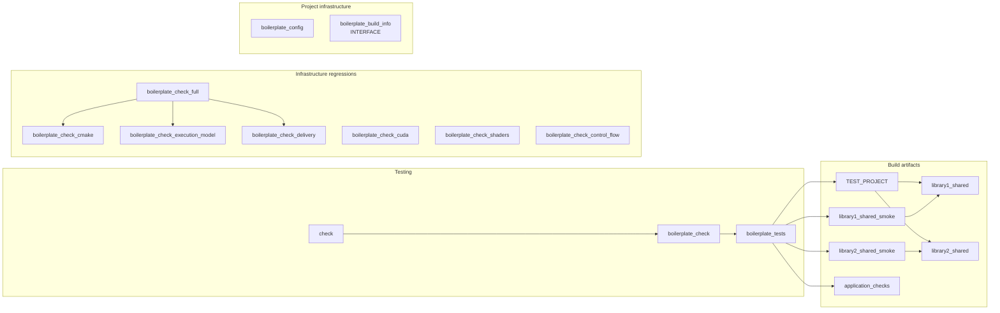
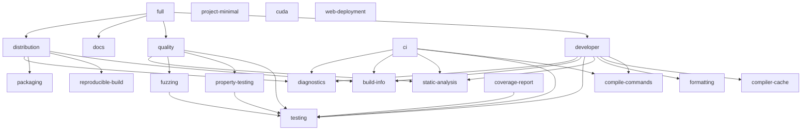

# CMake boilerplate: libraries, runtimes and applications

[](https://www.bestpractices.dev/projects/15343)

## One command: prepare, build, test, and optionally run

Linux / macOS (Bash 3.2+):

```bash
./setup.sh --run
# Or create a renamed project and run it in the same invocation:
./setup.sh --init MyProject --output ../MyProject --run
```

Windows (Windows PowerShell 5.1+ or PowerShell 7):

```powershell
.\setup.ps1 -Run
# Or generate, configure, build, test and launch a new project:
.\setup.ps1 -Init MyProject -Output ..\MyProject -Run
```

`setup` detects installed tools, provisions missing supported host dependencies,
activates the toolchain **for its own process**, configures with the default
`app-release` preset, builds and runs CTest. `--run` / `-Run` additionally launches
the program through its CMake target; omit it for services/GUI programs you do not
want to start automatically. No Python, pip, venv, user-shell configuration or
manual invocation of CMake is needed. Tool installation can request administrator
permissions, downloads, or a reboot/Command Line Tools approval.

Use `--profile dev`, `--preset app-debug`, `--jobs 8`, `--no-tests`,
`--setup-only`, or `--dry-run` as needed; PowerShell also accepts `-Profile`,
`-Preset`, `-Jobs`, `-NoTests`, `-SetupOnly` and `-DryRun`. `--run-target NAME`
builds an arbitrary CMake target but **does not** launch it. `--install-artifacts`
installs built artifacts to the preset-specific output directory.

To rebuild later without provisioning host packages, run `./build.sh --run` or
`.\build.ps1 -Run`. Configuration, build, tests, launch, and optional install
remain available individually with CMake/CTest for advanced users.

`setup.sh` is included **in generated projects**, along with both activation and
entry-option modules; copying the generated project does not require retaining
this template checkout.

`OUTPUT` defaults to `./<NAME>` and must be absent or empty. Names start with a
letter, followed by alphanumeric groups separated by single underscores or hyphens.
Build-system names such as `install`, `TEST` and `All_Build` are reserved regardless
of case.

The initializer renames the project/application, application test target,
standalone library workspace, vcpkg package and container image defaults.
`MyProject` becomes `my-project` for package/image names. The `boilerplate_*` API,
presets, example libraries `library1`/`library2` and license remain intact.
An explicit file manifest excludes Git history, generated docs, local build trees,
SDK checkouts and personal configuration. No files are downloaded or installed.
See [initializer maintenance and tests](scripts/README.md#project-initializer).

CMake 3.26+, Ninja for the supplied presets, GCC/Clang or MSVC for ordinary builds.
The default application and two example libraries require no downloaded packages.
C++23 is the default; `BOILERPLATE_CXX_STANDARD=17|20|23` selects the language level.
Project defaults live in CMake/presets; per-target policies compose owned-target settings. Optional
Google Benchmark, GoogleTest and libFuzzer integrations coexist with a small
independent process harness and dependency-free correctness tests.

## Start

Cross compilation is selected by toolchain presets: `linux-arm64`,
`windows-x64-from-linux`, `android-arm64`, `wasm32-emscripten`. Capabilities and
target policies remain independent. See [SDK requirements, host tools and emulator
execution](toolchains/README.md).

Run from the repository root:

```sh
cmake --workflow --preset app-debug
# Equivalent individual steps:
cmake --preset app-release
cmake --build --preset app-release --parallel 4
ctest --preset app-release
```

For a library/runtime project:

```sh
cmake --preset lib-release
cmake --build --preset lib-release --parallel 4
ctest --preset lib-release
cmake --build --preset lib-release --target boilerplate_check_cmake
```

`lib-*` presets also work from `lib/` as a standalone source tree. Root and `lib/`
have separate `out/build` directories; stay in the same directory for all steps.
`cmake --list-presets=all` lists configurations. Configure/build/test presets have
the same names for all `app-*` and `lib-*` profiles. Old application preset names
are retained. Use fresh build trees when migrating from the older global flags.

## Mental Model


```
Workspace / project configure
├─ Capabilities        -> one project-wide workflow/lifecycle
├─ Components          -> optional scale boundary for source-tree ownership
│  └─ Targets
│     ├─ Library
│     ├─ Runtime
│     ├─ Application
│     │  └─ Host(s)
│     └─ Plugin(s)
└─ Unscoped targets    -> small projects may skip components entirely

Target
└─ Policies            -> compile/link/build semantics
```

## What to copy

There are now two deliberate reusable layers:

- **`lib/cmake/`** — standalone library/tool core. It has no application, host,
  plugin-hosting or application-deployment dependency and can be extracted with
  `lib/` as an independent project. See the [library/core API](lib/README.md).
- **`cmake/` + `lib/cmake/`** — full component/execution framework. The root
  layer adds `Runtime`, `Application`, `Host`, `Plugin` and deployment semantics
  on top of the same core. Keep the checked-in relative layout, or set
  `BOILERPLATE_CORE_MODULE_DIR` before including the full facade.

Library-only project:

```cmake
cmake_minimum_required(VERSION 3.26)
include(cmake/Bootstrap.cmake)
boilerplate_bootstrap()
project(MyLibrary VERSION 1.0.0 LANGUAGES CXX)
include(cmake/Boilerplate.cmake)
boilerplate_project(CAPABILITIES developer)
boilerplate_add_library(core SOURCES src/core.cpp INCLUDE_DIR include)
boilerplate_finalize_project()
```

Full hosted application, with the repository layout preserved:

```cmake
cmake_minimum_required(VERSION 3.26)
include(cmake/Bootstrap.cmake)
boilerplate_bootstrap()
project(MyProduct VERSION 1.0.0 LANGUAGES CXX)
include(cmake/Boilerplate.cmake)
boilerplate_project(CAPABILITIES developer)

boilerplate_add_library(core SOURCES lib/core.cpp INCLUDE_DIR include)
boilerplate_add_runtime(engine SOURCES src/engine.cpp LIBRARIES core::core)
boilerplate_add_application(editor SOURCES src/editor.cpp RUNTIMES engine)

# Additional process realization of the same application image.
boilerplate_add_host(editor_cli KIND CONSOLE)
boilerplate_host_application(editor_cli editor)

boilerplate_finalize_project()
```

The library header includes `core_export.h` and uses `CORE_EXPORT` on its public
functions/classes. Targets `core::shared`, `core::static`, `core::core` are provided;
`core::core` prefers shared when both variants exist. Installation generates
relocatable `find_package(core CONFIG REQUIRED)` packages and unique export headers.
`PUBLIC_LIBRARIES`, `PRIVATE_LIBRARIES` and custom `PACKAGE_CONFIG` support dependencies.
No allocator implementation, runtime API or benchmark CLI is assumed by the modules.

The two checked-in example libraries are intentionally **not clones**. `library1`
is dependency-free and owns a local policy pack with different shared/static
variant policies. `library2` has a public `Threads::Threads` dependency, its own
installed package config with `find_dependency(Threads)`, a different local policy
pack and target PCH. `boilerplate_check_cmake` installs and relocates both packages
and builds separate consumers, so per-library customization is a regression fixture
rather than README-only syntax.

## Ready knobs

Pass `-DNAME=value` at configure time. Lists use semicolons; quote the whole argument.

| Knob | Default / purpose |
| --- | --- |
| `BOILERPLATE_LIBRARIES_ONLY` | OFF; root entry point skips application/examples/fuzz/docs when ON |
| `BOILERPLATE_BUILD_APPLICATION` | ON; sample application |
| `BOILERPLATE_BUILD_SHARED`, `BOILERPLATE_BUILD_STATIC` | Shared ON, static OFF by default; presets may select both |
| `<NAME>_BUILD_SHARED`, `<NAME>_BUILD_STATIC` | Per-library overrides, e.g. `LIBRARY1_BUILD_STATIC` |
| `BOILERPLATE_BUILD_TESTS`, `BUILD_TESTING` | Dependency-free checks; root defaults ON, standalone `lib` presets enable them |
| `BOILERPLATE_BUILD_GOOGLE_TESTS` | OFF; optional GoogleTest suites |
| `BOILERPLATE_BUILD_BENCHMARKS` | OFF; custom benchmark examples |
| `BOILERPLATE_BUILD_GOOGLE_BENCHMARKS` | OFF; Google Benchmark examples; may be ON together with custom benchmarks |
| `BOILERPLATE_BENCHMARK_GROUPS` | `all`; select `custom;google` or project-defined groups |
| `BOILERPLATE_BUILD_<TARGET>` | Per-benchmark switch, e.g. `BOILERPLATE_BUILD_LIBRARY1_BENCH` |
| `BOILERPLATE_BUILD_EXAMPLES` | OFF; explicit application/example targets |
| `BOILERPLATE_BUILD_QT_EXAMPLE` | OFF; Qt 6 Widgets example, enabled by `app-qt-*` presets |
| `BOILERPLATE_BUILD_PROPERTY_TESTS` | OFF; RapidCheck property-test example |
| `BOILERPLATE_BUILD_FUZZERS` | OFF; byte-fuzz harness example (`libfuzzer|aflpp|honggfuzz`) |
| `BOILERPLATE_BUILD_FUZZTESTS` | OFF; Google FuzzTest example |
| `BOILERPLATE_CXX_STANDARD` | 23; 17/20/23 supported |
| `BOILERPLATE_WARNINGS`, `BOILERPLATE_WARNINGS_AS_ERRORS` | ON / OFF; target-scoped warnings |
| `BOILERPLATE_HARDENING` | OFF; stack protector, Linux RELRO; avoids forcing executable PIE flags onto libraries |
| `BOILERPLATE_COVERAGE` | OFF; gcov-compatible instrumentation, requires GCC/Clang without LTO/PGO |
| `BOILERPLATE_CCACHE`, `BOILERPLATE_CLANG_TIDY`, `BOILERPLATE_UNITY_BUILD` | OFF; use the corresponding existing tools / CMake feature |
| `BOILERPLATE_FRAME_POINTERS` | OFF; preserve frame pointers for profiling/unwinding |
| `BOILERPLATE_INSTALL` | ON; package exports and application installation |
| `BOILERPLATE_PROJECT_CAPABILITIES` | `developer`; top-level project capability composition |
| `BOILERPLATE_EMBEDDED_PROJECT_CAPABILITIES` | `project-minimal`; behavior under `add_subdirectory()` |
| `BOILERPLATE_DEPENDENCY_PROVIDER` | `system`; `none|system|vcpkg|fetchcontent|cpm` bootstrap metadata/toolchain mode |
| `BOILERPLATE_COMPILER_CACHE` | `auto`; `sccache|ccache|none` project launcher policy |
| `BOILERPLATE_DIAGNOSTICS_VERBOSE` | OFF; keep configure output compact, full graph stays in `boilerplate-project.txt` / `boilerplate_config` |
| `BUILD_DOCS`, `ENABLE_PACKAGING` | OFF; append `docs` / `packaging` project capabilities in this example root |
| `BOILERPLATE_FETCH_DEPENDENCIES` | OFF; explicitly permit pinned FetchContent fallback |
| `BOILERPLATE_PBT_BACKEND` | `rapidcheck`; property-testing backend |
| `BOILERPLATE_FUZZ_BACKEND` | `libfuzzer`; `libfuzzer|aflpp|honggfuzz` |
| `BOILERPLATE_FUZZ_SANITIZER` | `address-undefined`; fuzz-harness instrumentation |
| `BOILERPLATE_FUZZTEST_MODE` | `unit`; `unit|fuzzing|libfuzzer` |

The checked-in `vcpkg.json` exposes optional manifest features `tests`, `pbt`,
`benchmarks`, `graphics`, and `qt`; byte-fuzz engines remain host tools/compiler
wrappers rather than library dependencies. The manifest baseline is pinned, so
CI/local installs resolve the same port graph; package versions come from that
baseline unless a feature genuinely needs a separate minimum constraint.

Find installed packages with `CMAKE_PREFIX_PATH` or use a package-manager toolchain
via `CMAKE_TOOLCHAIN_FILE` **on the initial configure**. Default presets do not
require vcpkg. Disabled components do not search for their optional dependencies.
There are no unconditional clang-tidy/IWYU/ccache invocations or global optimization
flags. The reusable core lives in `lib/cmake/`; the root `cmake/` directory is now a
thin higher-level execution layer rather than a duplicate build implementation.

With `BOILERPLATE_DEPENDENCY_PROVIDER=vcpkg`, an explicit `CMAKE_TOOLCHAIN_FILE`
takes priority. Otherwise bootstrap and `build_all.*` resolve vcpkg in this order:
`BOILERPLATE_VCPKG_ROOT`, CMake variable `VCPKG_ROOT`, environment `VCPKG_ROOT`,
`vcpkg/`, `external/vcpkg/` or `third_party/vcpkg/` under the source directory,
the `vcpkg` executable in `PATH` (following symlinks), `vcpkg/` under `HOME`,
`USERPROFILE` or `LOCALAPPDATA`, then `VSINSTALLDIR/VC/vcpkg`.
Candidates must contain `scripts/buildsystems/vcpkg.cmake`; an invalid explicit
root fails instead of silently selecting another installation. The selected root
is printed during configuration. By default nothing is downloaded by discovery.
`BOILERPLATE_VCPKG_BOOTSTRAP=ON` instead provisions a pinned checkout when no
explicit root/toolchain is supplied. The revision comes from the manifest
`builtin-baseline` or `BOILERPLATE_VCPKG_REVISION` (a full Git commit). Managed
checkouts live in `BOILERPLATE_VCPKG_CACHE` (default `<build>/_deps`), are locked
while provisioning and reused offline. `BOILERPLATE_VCPKG_REPOSITORY` accepts a
local mirror. The official vcpkg toolchain bootstraps its executable and installs
manifest features. Applications must set `VCPKG_MANIFEST_FEATURES` before
`project()` and opt into bootstrap; dependency-free builds never call it.
Use a fresh build directory when
switching an already cached toolchain.

## Project capabilities

Project capabilities own **project lifecycle and workflows**, not target compile/link
semantics. They compose independently from `POLICIES` and have configure/finalize hooks:

```cmake
boilerplate_project(
  TOP_LEVEL_CAPABILITIES developer docs
  EMBEDDED_CAPABILITIES project-minimal)

# targets are registered here

boilerplate_finalize_project() # analysis/docs/package/diagnostic finalizers see the complete graph
```

Primitive capabilities: `project-minimal`, `compile-commands`, `compiler-cache`,
`formatting`, `static-analysis`, `testing`, `property-testing`, `fuzzing`, `coverage-report`, `docs`,
`packaging`, `reproducible-build`, `build-info`, `diagnostics`, `cuda`, and
`web-deployment`. Convenience compositions are `developer`, `quality`, `distribution`,
`ci`, and `full`; they are only named lists, not mutually exclusive rails.

`developer` gives compile commands, optional compiler cache, format/analyze workflows,
CTest, build metadata and diagnostics. Missing optional developer tools are skipped unless
`BOILERPLATE_REQUIRE_PROJECT_TOOLS=ON`. `distribution` adds reproducible source-path
mapping, build metadata and component-aware CPack packaging. `build-info` exposes both
`build-info-<config>.json` and `boilerplate::build_info` / `<boilerplate/build_info.hpp>`.

Bootstrap concerns that must precede `project()` stay separate. `Bootstrap.cmake` rejects
in-source builds and can discover an installed vcpkg toolchain; it deliberately does
not choose a compiler/generator. Embedded mode defaults to `project-minimal`, so consuming
a library with `add_subdirectory()` does not acquire the parent's docs, analysis, packaging,
fuzzing or developer workflows.

Instrumentation and workflows are deliberately split: target policy `coverage` adds
compiler/linker instrumentation, while project capability `coverage-report` creates the
CTest/lcov report pipeline. Likewise Qt/graphics/runtime remain target policies; packaging
is project lifecycle. `boilerplate_enable_qt_deployment(target)` attaches Qt's native deploy
script when available.
 PCH and shaders remain explicit source-aware helpers instead of artificial
boolean capabilities; unity builds are a target policy.

## Workspace components for large trees

Components are an **optional grouping layer**, not another project lifecycle. A large
monorepo still calls `boilerplate_project()` once, configures many component subtrees,
and calls `boilerplate_finalize_project()` once. Small projects can keep ordinary
`add_subdirectory()` and do not pay for or learn this layer.

```cmake
boilerplate_project(CAPABILITIES developer)

boilerplate_add_component(core
  SOURCE_DIR libs/core
  FOLDER "components/core")
boilerplate_add_component(network
  SOURCE_DIR libs/network
  FOLDER "components/network")
boilerplate_add_component(server
  SOURCE_DIR apps/server
  FOLDER "components/apps/server")

boilerplate_finalize_project()
```

Targets created by the framework inside a component are registered automatically and
receive `BOILERPLATE_COMPONENT`. `FOLDER` supplies IDE grouping for Visual Studio and
other folder-aware generators. `boilerplate_list_components()` and
`boilerplate_component_targets()` expose the registry to diagnostics or project-local
tooling. A raw `add_library()` / `add_executable()` remains an escape hatch; call
`boilerplate_register_target(target [COMPONENT name])` when a raw target should join the
component ownership registry. Project-wide finalizers still see the complete CMake graph,
including unregistered escape-hatch targets; once finalization begins that graph is frozen
and its recursive target walk is cached for subsequent analysis/diagnostic hooks.

A component that must also build standalone owns a lifecycle **only when it is the CMake
root**:

```cmake
cmake_minimum_required(VERSION 3.26)
if(CMAKE_SOURCE_DIR STREQUAL CMAKE_CURRENT_SOURCE_DIR)
  project(Storage VERSION 1.0 LANGUAGES CXX)
  include(cmake/Boilerplate.cmake)
  boilerplate_project(CAPABILITIES developer)
  boilerplate_component(storage FOLDER "components/storage")
endif()

boilerplate_add_library(storage ...)

if(CMAKE_SOURCE_DIR STREQUAL CMAKE_CURRENT_SOURCE_DIR)
  boilerplate_finalize_project()
endif()
```

When embedded through `boilerplate_add_component(storage SOURCE_DIR libs/storage)`, the
parent lifecycle is reused and the component identity is inherited by the whole subtree.
This keeps the scale model `one workspace lifecycle -> many components -> many targets`
instead of creating a second capability/hook engine per directory.

## Per-target policies

Project presets choose the toolchain/configuration and provide defaults. Targets are
the composition unit. `POLICIES` can reset or layer build capabilities without
creating a preset for every combination:

```cmake
# Small std-only denominator even inside a heavily tuned parent build.
boilerplate_add_library(core
  SOURCES src/core.cpp INCLUDE_DIR include
  POLICIES minimal)

# Built-in runtime archetypes are already compositions of orthogonal pieces.
boilerplate_add_library(runtime_core
  SOURCES src/runtime.cpp INCLUDE_DIR include
  POLICIES runtime-dagflow)

# Capabilities remain composable: Qt/graphics do not reset runtime tuning.
boilerplate_add_executable(inspector
  SOURCES tools/inspector.cpp
  POLICIES runtime-dagflow qt-widgets)
```

Policies compose left-to-right. `POLICY_OPTIONS KEY value ...` is the final per-target
override. Policy hooks are the extension point for non-flag mechanics. Built-ins now include
`runtime-dagflow`, `runtime-webserver`, diagnostic runtime policies, Qt6 capability
policies, and Vulkan/GLFW/GLEW/GLM/ImGui capability policies. Shader compilation is
an explicit source-aware helper. See [`lib/README.md`](lib/README.md#target-policies-and-composition)
for the full composition model.

Control-flow policies are also reusable: `cfi`, `cfi-icall`, `cfi-vcall` and
`windows-cfg`. `runtime-hardened` composes `runtime`, `hardening` and `cfi`.
For example, `POLICIES runtime-hardened` enables Clang CFI with ThinLTO/lld on Linux;
Windows uses `POLICIES runtime hardening windows-cfg`. CFI traps by default;
`POLICY_OPTIONS CFI_DIAGNOSTICS ON` enables fatal diagnostics. The backend validates
the compiler and link requirements during configuration. See the
[control-flow API and DLL/plugin limits](lib/README.md#control-flow-protection).

```sh
cmake --preset app-debug
cmake --build --preset app-debug --target boilerplate_check_control_flow
```


### Property/PBT and fuzz stack

The reusable testing layer now separates RapidCheck property tests, byte-oriented
`LLVMFuzzerTestOneInput` fuzzing (libFuzzer/AFL++/honggfuzz), and Google FuzzTest.
See [`lib/README.md`](lib/README.md#property-testing-and-fuzzing) for the helper API,
compiler-wrapper requirements and vcpkg `pbt` feature.

## Shaders, plugins and deployment

The `app-qt-debug` and `app-qt-release` presets build the Qt 6 Widgets example
with matching configure, build, test and workflow presets:

```sh
cmake --workflow --preset app-qt-debug
# Equivalent individual steps:
cmake --preset app-qt-release
cmake --build --preset app-qt-release --parallel 4
ctest --preset app-qt-release
# Launch the window on a desktop:
./out/build/app-qt-release/examples/qt/qt_widgets_example
```

Install Qt 6 Core/Gui/Widgets development packages and tools. For a separate Qt
SDK, pass `-DCMAKE_PREFIX_PATH=/path/to/Qt/6.x/platform` on configuration.
The example uses the `qt-widgets` target policy and exercises AUTOMOC, AUTOUIC
and AUTORCC. Its smoke test uses `QT_QPA_PLATFORM=offscreen` and exits automatically,
so CTest requires no display server. Ordinary presets keep the Qt example disabled.
QML/Quick applications can use the existing `qt-qml-app` policy on their targets;
these two presets select the Widgets example.

CUDA targets use `cuda`, `cuda-debug`, `cuda-profiled`, `cuda-fast-math`, or the
`runtime-cuda` composition after enabling the `cuda` project capability.
The `app-cuda-debug` and `app-cuda-release` presets enable that capability with
Debug/Release configuration and provide matching build, test and workflow presets:

```sh
cmake --workflow --preset app-cuda-release
# Or configure explicitly (choose architectures for your deployment):
cmake --preset app-cuda-debug -DBOILERPLATE_CUDA_ARCHITECTURES=75
cmake --build --preset app-cuda-debug --parallel 4
ctest --preset app-cuda-debug
cmake --build --preset app-cuda-debug --target boilerplate_check_cuda
```

These presets require NVIDIA nvcc and default to `native` GPU architectures.
Without a working GPU/driver, override the architecture as above. CUDA policies
are still selected per target; the Debug preset alone does not enable device
debugging (`cuda-debug`). The sample application remains CPU-only; the explicit
`boilerplate_check_cuda` target builds the CUDA fixtures.
See [CUDA profiles and checks](lib/cmake/docs/Cuda.md) for device architectures,
runtime linkage, compatibility limits and a real nvcc regression check.

Shader helpers support GLSL/SPIR-V and HLSL/DXC, named variants and transitive
include dependencies. The full application layer is semantic rather than CMake-type
driven: `boilerplate_add_application()` creates a hosted application image,
`boilerplate_add_runtime()` creates a private linkable runtime image, and
`boilerplate_add_plugin()` creates a runtime-loaded extension. `HOST` is an
orthogonal execution role: create one with `boilerplate_add_host()` and attach a
typed edge with `boilerplate_host_application()` or `boilerplate_host_plugin()`.
The compatibility helper `boilerplate_add_apphost()` remains sugar for the common
application case.

Plugin composition and plugin placement are deliberately separate. An
`APPLICATION -> PLUGIN` edge says that the plugin belongs to the application's
extension set. With no explicit plugin host it follows the application's hosts
(the normal in-process/co-hosted case); a `HOST -> PLUGIN` edge gives it explicit
execution placement, for example a dedicated sandbox/plugin process. The framework
deploys the resulting topology but does not impose a universal plugin callback ABI:
the application/runtime or custom plugin host owns loading and negotiation.

Ordinary `boilerplate_add_library()` targets stay consumer-facing and belong to the
standalone core slice; `boilerplate_add_executable()` remains available for genuine
standalone tools. `boilerplate_install_application()` deploys from the application
root into a private module graph (`bin/`, `lib/<app>/`, `lib/<app>/plugins/`,
`share/<app>/`), while `boilerplate_install_host()` supports standalone/custom host
roots such as plugin hosts. See the [delivery API](cmake/Delivery.md) and the
`boilerplate_check_execution_model` regression target.

## Optimization profiles

`BOILERPLATE_PROFILE` is the project/configuration default; target policies may override its optimization choices.

`BOILERPLATE_PROFILE`: `custom`, `debug`, `relwithdebinfo`, `release`, `lto`
(ThinLTO), `full-lto`, `native-thinlto`, `native-full-lto`, `o3` (release + symbols),
`o3-lto`, `pgo-generate`, `pgo-use`, `lto-pgo-generate`, `lto-pgo-use`,
`native-full-lto-pgo-generate`, `native-full-lto-pgo-use`.

Individual knobs remain available: `BOILERPLATE_LTO_MODE=none|thin|full`,
`BOILERPLATE_ENABLE_NATIVE`, `BOILERPLATE_DEBUG_SYMBOLS`,
`BOILERPLATE_ENABLE_NO_SEMANTIC_INTERPOSITION`, `BOILERPLATE_ENABLE_NO_PLT`,
`BOILERPLATE_ENABLE_GC_SECTIONS`, `BOILERPLATE_USE_LLD`, `BOILERPLATE_ENABLE_ICF`,
`BOILERPLATE_ARTIFACT_SUFFIX`. ELF-specific switches are applied only on Linux.
`BOILERPLATE_SANITIZER=none|address|undefined|address-undefined|thread|leak`.

Useful presets: `lib-static`, `lib-shared`, `lib-aggressive` (native Full LTO,
section GC, no-PLT, no semantic interposition, lld/ICF), `lib-address-undefined`,
`lib-thread`, `app-asan`, `app-tsan`, `app-hardening`, `app-coverage`, `app-fuzz`.
Named profiles own build type/LTO/PGO and select the corresponding configuration
for both single-config and multi-config generators. With Visual Studio or Ninja
Multi-Config, pass the matching `--config`. Use `custom` to retain several configs.
Requested GNU-style optimization/instrumentation flags are compile-and-link
probed, including required runtimes. LTO tries the system linker first and can
fall back to LLD after a successful probe; ARM native optimization uses `-mcpu`.
Unsupported explicit policies fail at configure time.
Native profiles target the build CPU; use ordinary release for portable distribution.
MSVC supports ordinary builds/full IPO; GNU-style Clang is required for ThinLTO
and the supplied PGO/fuzzer profiles. Unsupported combinations fail at configure time.

## General research harness

For repeatable runtime/server experiments, `lib/cmake/benchmark/Harness.cmake` exposes a
self-contained CMake process harness shipped inside the reusable `lib/cmake/` tree.
Running the harness does not require Python.

```cmake
boilerplate_add_harness(runtime_matrix
  TARGET runtime_bench
  CASES "${CMAKE_CURRENT_SOURCE_DIR}/bench/cases.json"
  ROUNDS 9 WARMUP_RUNS 2 TIMEOUT 120
  AFFINITY physical RANDOMIZE
  METRICS run_p50_us payload_tasks_per_second
  INVARIANTS checksum)
```

The generic runner owns subprocess lifecycle, process-group timeout/kill, CPU topology
and affinity, SHA256 provenance, raw logs, randomized rounds, JSON metric summaries,
invariant checks and optional Linux `perf stat` parsing. Domain semantics stay in the
project adapter/cases file. See the
[harness guide](lib/cmake/benchmark/README.md) and
[CMake module map](lib/cmake/README.md).

## Custom harness AND Google Benchmark

Both can be enabled together:

```sh
# Uses installed benchmark package. Add the last switch to permit downloading it.
cmake --preset lib-bench-both -DBOILERPLATE_FETCH_DEPENDENCIES=ON
cmake --build --preset lib-bench-both --parallel 4
ctest --preset lib-bench-both
```

Normal builds never execute measurements. CTest runs small correctness cases and
Google Benchmark registration listing. Explicit measurement commands:

```sh
cmake --build --preset lib-bench-both --target run_sum_small
cmake --build --preset lib-bench-both --target run_library1_google_bench
cmake --build --preset lib-bench-both --target run_group_custom
```

`boilerplate_benchmarks` builds all enabled benchmarks; `benchmarks_custom` and
`benchmarks_google` build individual groups. A `run_group_*` executes its scenarios
sequentially even with `--parallel`; running one scenario does not run its siblings.
Independent groups/manual invocations can still overlap; avoid that for comparisons.
Select a group with `-DBOILERPLATE_BENCHMARK_GROUPS=custom` or disable a binary with
`-DBOILERPLATE_BUILD_LIBRARY1_GOOGLE_BENCH=OFF`; this also avoids finding Google Benchmark.

The **process harness** accepts any executable. Knobs:
`BOILERPLATE_RUN_REPEATS=5`, `BOILERPLATE_RUN_WARMUP=1`,
`BOILERPLATE_RUN_TIMEOUT=60`, `BOILERPLATE_RESULTS_DIR`,
`BOILERPLATE_<SCENARIO>_ARGS` (CMake argument list), `BOILERPLATE_COMMAND_PREFIX`.
Example Linux prefix: `'-DBOILERPLATE_COMMAND_PREFIX=taskset;-c;2'` or
`'-DBOILERPLATE_COMMAND_PREFIX=perf;stat;--'`. Tools are supplied by the caller;
CMake does not change CPU governor, affinity or privileges automatically.

Each run creates a unique result directory with stdout/stderr per invocation,
exit/timeout status, arguments, executable SHA256, source revision when available,
profile/compiler settings and min/median/mean/p95 in microseconds. Environment
variable names are recorded, not their values. The timer is CMake wall time for
the entire subprocess, including startup; warmups launch separate processes.
Use it for end-to-end workloads. Short timings and wall-clock adjustments are not
a basis for microbenchmark claims. Failed runs fail the target and retain logs.

**[Google Benchmark](https://google.github.io/benchmark/user_guide.html)** provides
in-process timing, repetitions and JSON/CSV reporting. Its example runs once through
the process wrapper and uses its own repetitions; its native JSON is under
`results/google/` (same target/config overwrites that native file on another run).
The independent process wrapper logs remain unique. The sample uses
`DoNotOptimize`; replace its operation with your workload. Fallback versions are
pinned to Google Benchmark v1.9.5 and GoogleTest v1.17.0 and can be overridden via
`BOILERPLATE_GOOGLE_BENCHMARK_TAG` / `BOILERPLATE_GOOGLETEST_TAG`.
Offline checkouts work through standard `FETCHCONTENT_SOURCE_DIR_GOOGLEBENCHMARK`
and `FETCHCONTENT_SOURCE_DIR_GOOGLETEST` overrides with fetching enabled.

## Checks, GoogleTest and fuzzing

```sh
cmake --workflow --preset app-google-tests
cmake --build --preset app-debug --target boilerplate_check
ctest --preset app-debug -L smoke
ctest --preset app-google-tests -L google
cmake --preset app-fuzz
cmake --build --preset app-fuzz
ctest --preset app-fuzz -L fuzz           # bounded -runs=1 smoke
# Explicit longer fuzzing:
cmake --build --preset app-fuzz --target fuzz_fuzz_target
```

Plain checks return nonzero on failure (work with NDEBUG). GoogleTest uses CMake's
`GoogleTest` discovery module. libFuzzer uses Clang's sanitizer runtime, keeps corpus
under the build tree and has bounded explicit run targets. To fuzz a linked library,
build a separate instrumented archive with `boilerplate_add_fuzz_library()` and
link it into `boilerplate_add_fuzzer()`. The normal library stays separate;
instrumenting the fuzz entry alone does not cover compiled dependencies. Sanitizer smoke validation in restricted
ptrace environments may need `ASAN_OPTIONS=detect_leaks=0`; this disables leak
checking only for that invocation, not in the presets.

## API documentation

Documentation is generated directly by CMake's `doxygen_add_docs()` in
`lib/cmake/project/Documentation.cmake`; Python is not required. CMake generates
the Doxyfile in the build directory. Install Doxygen and optionally Graphviz
(`dot`) for diagrams, then run:

```sh
cmake -S . -B out/build/docs -G Ninja -DBUILD_DOCS=ON
cmake --build out/build/docs --target docs
```

Open `out/build/docs/html/index.html`. The documentation includes the project
guides and the public `proj`, `lib1` and `lib2` APIs, with parameters, return
values, integer-overflow preconditions and worker-thread behavior. Tests,
benchmarks and generated build trees are excluded from the API inputs.
`BOILERPLATE_DOC_INPUTS` overrides the input paths. Doxygen warnings fail the
docs target by default; `BOILERPLATE_DOC_WARN_AS_ERROR=OFF` makes them nonfatal.
Generation does not require compiling the application or downloading packages.

## PGO and build matrices

```sh
cmake --preset lib-native-full-lto-pgo-generate
cmake --build --preset lib-native-full-lto-pgo-generate --target boilerplate_pgo_merge
cmake --preset lib-native-full-lto-pgo-use
cmake --build --preset lib-native-full-lto-pgo-use
ctest --preset lib-native-full-lto-pgo-use
```

Training is explicit. `boilerplate_pgo_train` trains; `boilerplate_pgo_merge_only`
merges existing profiles; `boilerplate_pgo_merge` does both. Register realistic
bounded training via `boilerplate_pgo_workload` or scenario `PGO_ARGS`.
`BOILERPLATE_PGO_DIR`, `BOILERPLATE_PGO_MERGED_PROFILE`, `BOILERPLATE_PGO_PROFILE`,
`BOILERPLATE_LLVM_PROFDATA` control paths/tools. Updated profiles invalidate object
files, including later `target_sources()` additions in their target directory.
Use fresh raw profile directories after changing code. GCC manual PGO uses the same
build/object paths for generate/use, with no LLVM merge step.

```sh
cmake '-DPRESETS=app-debug;app-release;lib-static;lib-shared' -DJOBS=4 \
  -P lib/cmake/build/BuildMatrix.cmake
# Or the thin shell/PowerShell wrapper:
./build_all.sh '-DPRESETS=app-debug;app-release' -DJOBS=4
```

`build_all.sh` defaults to `MATRIX_PROFILE=all`: core debug/release plus `app-vcpkg-all`. It discovers vcpkg automatically; set `VCPKG_ROOT` to override or use `-DMATRIX_PROFILE=core` to skip package-manager coverage.

The matrix configures, builds, tests and installs each preset to
`out/artifacts/<preset>`. Set `ARTIFACT_DIR`, `RUN_TESTS=OFF`,
`INSTALL_ARTIFACTS=OFF`, or `CONFIGURE_ARGS` as needed. CMake install handles native
filenames/symlinks/export packages; there is no filename globbing for a specific
project. Packages include `share/<project>/build-info-<config>.json` with public
build settings and source revision/dirty state at configuration time.
For a Clang PGO pair, list generate before use and add `-DTRAIN_PGO=ON` explicitly.
Without it the matrix never trains; a fresh use preset fails without its profile.
Workflow presets use native `cmake --workflow` for one configure/build/test chain.

## Examples, allocators, references and comparisons

Examples are first-class executable workloads rather than a separate build model:

```cmake
boilerplate_add_example(allocator_example
  SOURCES examples/allocator.cpp
  SMOKE
  PGO
  LABELS allocator)
```

The helper creates the executable, adds it to `boilerplate_examples`, registers
`run_<name>` and the shared `run_group_examples` scenario target, and optionally
adds a bounded CTest smoke check and PGO workload. Building examples never runs
them implicitly.

```sh
cmake --preset app-examples -DBOILERPLATE_ALLOCATOR=mimalloc
cmake --build --preset app-examples --target boilerplate_examples
cmake --build --preset app-examples --target run_allocator_example
cmake --build --preset app-examples --target run_group_examples
ctest --preset app-examples -L allocator
```

`system`, `mimalloc`, `tbbmalloc` select an **explicit allocation adapter**.
`boilerplate_use_allocator(target)` links the selected dependency and defines
`BOILERPLATE_USE_MIMALLOC` / `BOILERPLATE_USE_TBBMALLOC`. The example shows matching
allocation/free calls. This does not globally replace malloc/new. Libraries using
such dependencies must also expose the appropriate installed `find_dependency()`.

For an old version or another implementation:

```sh
cmake --preset app-debug -DBOILERPLATE_REFERENCE_SOURCE_DIR=/path/to/reference \
  '-DBOILERPLATE_REFERENCE_CMAKE_ARGS=-DCMAKE_BUILD_TYPE=Release;-DBUILD_TESTING=OFF'
cmake --build --preset app-debug --target reference
```

This uses CMake `ExternalProject` with a separate cache and target namespace.
Reference builds are excluded from ALL; sources are explicit and not downloaded.
The API also supports explicit reference tests/installation. The project's adapter
must provide comparable workloads; CMake cannot infer equivalent APIs or settings.

For two successful process-harness outputs with matching scenario/arguments:

```sh
cmake -DBASELINE=/path/before/result.json -DCANDIDATE=/path/after/result.json \
  -DMAX_REGRESSION_PERCENT=10 -P lib/cmake/benchmark/CompareResults.cmake
```

This compares median end-to-end time; the threshold is optional and must account for
noise. Google Benchmark results use its official `tools/compare.py` through
`boilerplate_add_google_comparison()` ([API](lib/README.md)); Python and upstream
Python requirements are needed only for that optional comparison tool. Build policy,
process harness, matrix and simple comparison are implemented in CMake.

## Containers

Docker is deliberately **outside** the CMake capability graph. The Dockerfile consumes
the same public presets/install rules as a host build and has four explicit stages:
`dev -> build -> test -> runtime`. The default base is `debian:trixie-slim`: the dev
stage installs the normal GCC/Clang/CMake/Ninja toolchain plus analysis, coverage and
AFL++ tools from Debian packages, while the runtime stays on the same glibc family.
The runtime stage copies the CMake install tree; it does not know the project's internal
build-directory layout. Override `DEBIAN_IMAGE` at Docker build time if another Debian
13-compatible base is desired.

Native Bash and PowerShell wrappers keep common container commands short. The host
only needs Bash or PowerShell and Docker (or Podman); Python and CMake run inside the
image, not as prerequisites for the wrapper.

```sh
bash tools/container.sh dev
bash tools/container.sh dev --base-image debian:trixie-slim
bash tools/container.sh shell
bash tools/container.sh test --preset app-release
bash tools/container.sh build --preset app-release
bash tools/container.sh run --no-build -- --example "argument with spaces"
bash tools/container.sh clean
```

PowerShell uses native parameter names:

```powershell
./tools/container.ps1 dev
./tools/container.ps1 test -Preset app-release
./tools/container.ps1 shell -NoBuild
./tools/container.ps1 run -NoBuild -AppArgs @('--example', 'argument with spaces')
./tools/container.ps1 clean
```

Both wrappers support an image name (`--image` / `-Image`), an engine executable
(`--docker` / `-Docker`), and build flags (`--pull` / `-Pull`, `--no-cache` / `-NoCache`).
The default image name is `cmake-boilerplate`; dev/test stages use its `:dev`/`:test`
tags. `shell` and `run` build their image first unless `--no-build` / `-NoBuild` is set.
`clean` removes these three local image tags. Engine failures return a nonzero exit code.

`--preset` is simply forwarded as `CMAKE_PRESET` to the Docker build. Use another
preset when the image contains the corresponding toolchain/dependencies. `.dockerignore`
keeps host build trees, profiles and a local vcpkg checkout out of the context. Docker
is optional; no configure/build/test target requires a Docker daemon.

## Validation and platform limits

`boilerplate_check_cmake` builds a differently named generic fixture, tests installed
shared/static packages after relocation, checks late PGO source dependencies, configures
a 128-component workspace regression, and then runs the two intentionally different
example-library package/relocation consumers.
`boilerplate_harness_checks` covers quoted arguments, environment, cwd, warmups,
repetitions, JSON output, process failures and timeout propagation.
Linux/Clang/GCC are exercised locally. Windows/macOS paths and custom multi-config
builds are supported by design; they still need native platform CI before claiming
platform validation. Docs, packaging and the external container workflow remain optional.

### vcpkg registry checkout preflight

`build_all.*` validates the manifest `builtin-baseline` against the Git checkout at
the resolved vcpkg root before configuring a vcpkg preset. A shallow or stale checkout is
reported with a concrete `git fetch` repair command instead of failing later from
inside `vcpkg.cmake`.

### Export libraries as vcpkg ports

`library1` and `library2` also have portable, versioned release ports in the
repository's Git registry: pinned source commit + SHA512, `versions/baseline.json`,
and per-version `git-tree` entries. An independent project installs them with
vcpkg and links `library1::library1` / `library2::library2` through `find_package()`.
See [registry consumption, CI and release instructions](vcpkg/README.md#release-registry).

The library boilerplate can generate local or archive-backed overlay ports with
`boilerplate_vcpkg_port()`, including triplet-controlled shared/static builds and
CMake package fixups. See [vcpkg packaging](lib/README.md#publishing-libraries-through-vcpkg)
for the API and ready-to-install `library1` / `library2` examples.

Project-owned overlays live in `vcpkg/ports/` and `vcpkg/triplets/`, registered by
`vcpkg-configuration.json`. Existing vcpkg presets pick them up through the root
manifest; `vcpkg-linux-shared` demonstrates the custom Linux shared triplet.
See [the overlay layout and commands](vcpkg/README.md).

### One-command application packaging

After extracting the template, use one entry point for host preparation, configure,
compile, tests and platform packages (no Python, no separate `cpack` command):

```bash
./setup.sh --package                     # Linux/macOS
./setup.sh --init NewApp --package        # create + package in one command
./setup.sh --package --package-format TGZ # request a specific CPack format
```

```powershell
.\setup.ps1 -Package                    # Windows
.\setup.ps1 -Init NewApp -Package       # create + package in one command
```

Packages land under `out/packages/<preset>/`. `--install-artifacts` is separate:
packaging stages `install()` rules into the package, **not** the user's system.
Default formats: Linux TGZ plus DEB/RPM when their native tools are present;
Windows ZIP plus NSIS when `makensis` is present; macOS TGZ plus DMG when
`hdiutil` is present. `--package` selects the `package` host-tools profile by
default, which provisions supported native packagers and deployment tools. The
`--package-format` option forces one generator; unavailable tools then cause a
clear failure instead of a silent format downgrade. Signing/notarization of
installers is deliberately a separate release step.

### Prepare a development host

Use `./setup-host.sh --install --profile dev` on Linux/macOS or
`./setup-host.ps1 -Install -Profile dev` on Windows to install missing build,
editor, analysis, formatting, documentation and packaging tools plus vcpkg. Activate
`out/host-tools/env.sh` (Unix) or `out/host-tools/env.ps1` (PowerShell) afterwards.
The installers use only Bash/PowerShell; there is no Python, pip or venv bootstrap.
`--dry-run` / `-DryRun` shows commands; `--check` / `-Check` reports missing tools.
Profiles `minimal`, `dev` (default), and `ci` share one tool matrix. Every run reports
what was already available, what was installed and what is still missing.
The same entry points are available under `scripts/`.
The benchmark/process harness runs in CMake; bootstrap does not check Python.
See [host setup](scripts/README.md) for package managers, the tool matrix and
separately provisioned Python/SDK workflows.


### Visual Project scheme




### Capablity graph




### Configure/finalize semantics

```mermaid
flowchart LR
    subgraph Configure["configure phase"]
        CC["compile-commands"]
        CACHE["compiler-cache"]
        SA["static-analysis"]
        TEST["testing"]
        REPRO["reproducible-build"]
        INFO["build-info"]
        CUDA["cuda"]
    end

    subgraph Targets["project target graph"]
        TARGETS["add_library / add_executable / policies / registration"]
    end

    subgraph Finalize["finalize phase"]
        FORMAT["formatting"]
        SA2["static-analysis"]
        TEST2["testing"]
        PROP["property-testing"]
        FUZZ["fuzzing"]
        COV["coverage-report"]
        DOCS["docs"]
        PACKAGE["packaging"]
        DIAG["diagnostics"]
        WEB["web-deployment"]
    end

    Configure --> TARGETS
    TARGETS --> Finalize
```




### Native packages by operating-system family

`./setup.sh --init MyApp --run --package` (Windows: `./setup.ps1 -Init MyApp -Run -Package`) now creates a project, prepares tools, builds, runs CTest, launches the sample application, and produces packages in `out/packages/app-release/` of the new project. Without `--init`, it packages the current project. No Python is required.

| Host | Automatic output (when native tools are available) | Explicit option |
| --- | --- | --- |
| Debian, Ubuntu and ID_LIKE=debian | `.tar.gz`, `.deb` | `--package-format DEB` |
| Fedora, RHEL and ID_LIKE=fedora/rhel | `.tar.gz`, `.rpm` | `--package-format RPM` |
| Arch, CachyOS, Manjaro and ID_LIKE=arch | `.tar.gz`, `.pkg.tar.zst` | `--package-format ARCH` |
| macOS | `.tar.gz`, `.dmg` | `--package-format DragNDrop` |
| Windows | `.zip`, NSIS `.exe` | `-PackageFormat NSIS` |

On Arch the `.pkg.tar.zst` is built **with `makepkg`**, not CPack. Run the bootstrap as a **normal user**, never root; `sudo` is used for system dependencies, while `makepkg` stages `cmake --install` into its own `pkgdir`. The build is not repeated. The `package` tool profile ensures fakeroot, zstd, and makepkg prerequisites are present. Package dependencies/signatures, Windows code signing, and Apple notarization remain release policy owned by the application; the boilerplate does not invent them.

Linux detection reads `/etc/os-release` (`ID`, `ID_LIKE`); installed `rpm` or `dpkg-deb` executables do not change the family. If the native tool is missing during a **build-only** invocation, CPack falls back to TGZ and emits a warning. `setup.sh --package` installs supported native tooling first. Explicit formats override automatic selection, except that `ARCH` is only supported on Linux with makepkg. The `Bootstrap E2E` workflow runs the one-command path on Windows/macOS/Ubuntu and in Fedora/Arch containers, verifies the native artifacts, and uploads them. These checks require an actual CI run to establish portability.
